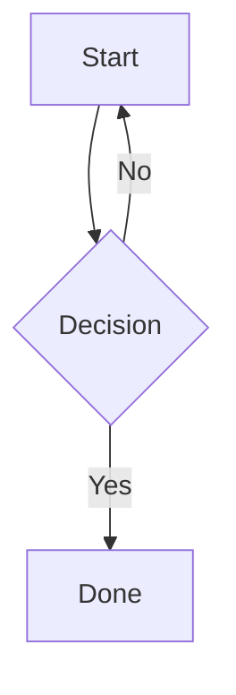

# Mermaid Diagrams for Odoo 19

Render [Mermaid.js](https://mermaid.js.org/) diagrams directly in Odoo Knowledge articles and HTML fields.

## Features

- Select "Mermaid" from code block language dropdown
- Live diagram rendering
- Light/Dark theme support
- Flowcharts, sequence, class, state, ER, Gantt, pie charts and more

## Usage

1. Insert code block (`/code`)
2. Enter Mermaid syntax
3. Select **Mermaid** language
4. Diagram renders automatically



## Install

```bash
git clone https://github.com/K11E3R/mermaid_diagram.git
```

Then install from Odoo Apps.

## License

LGPL-3.0

## Author

**K11E3R** - [@K11E3R](https://github.com/K11E3R)
