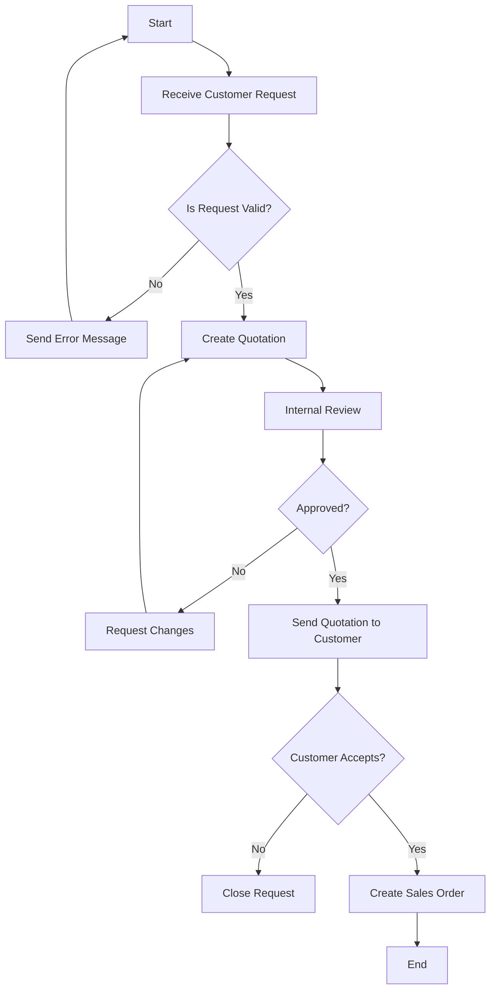
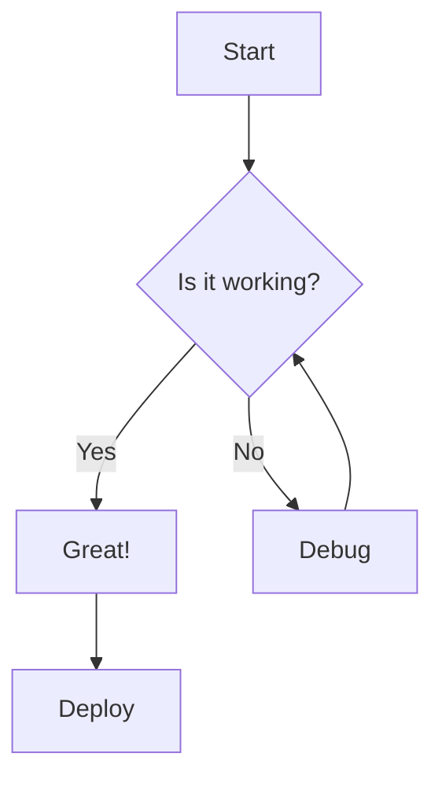
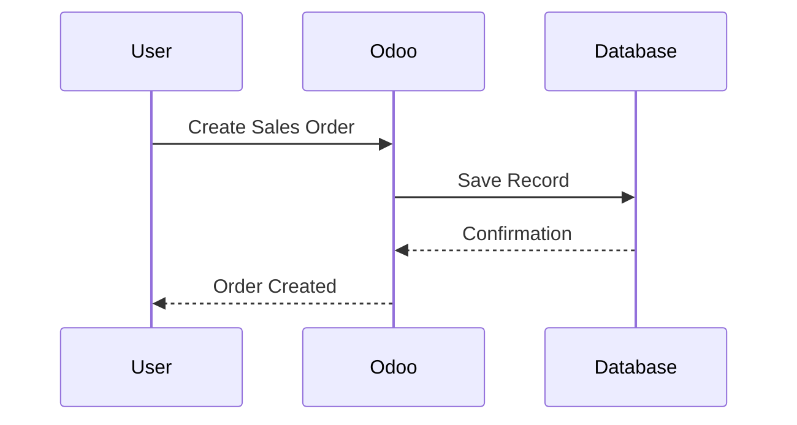
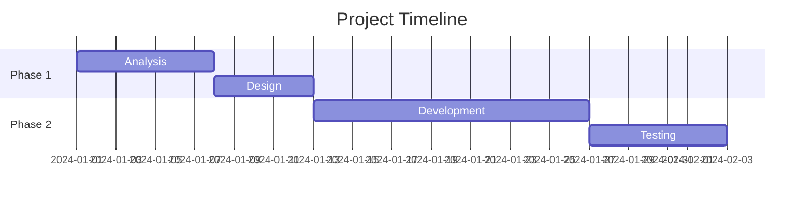
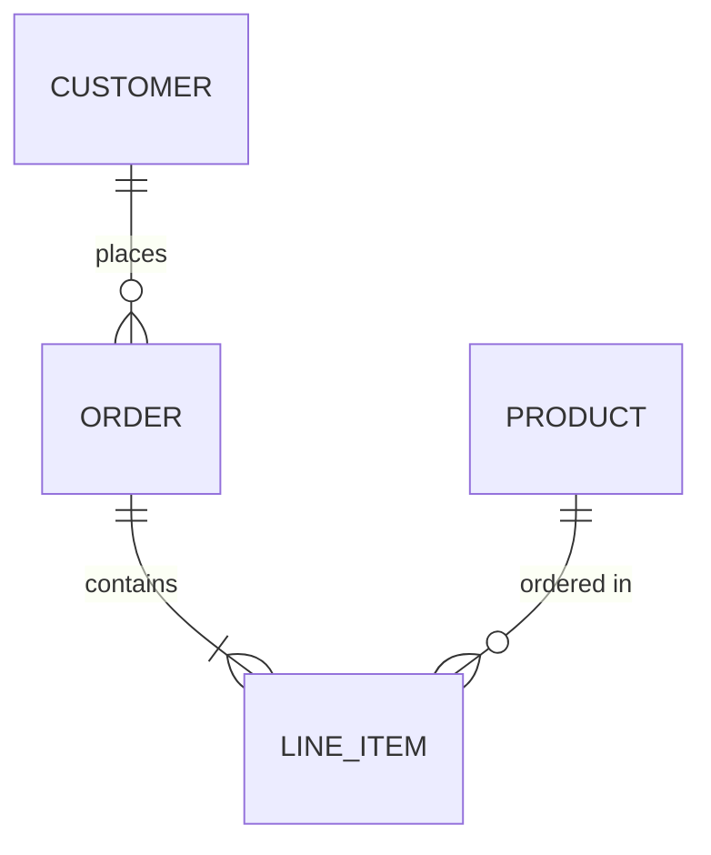
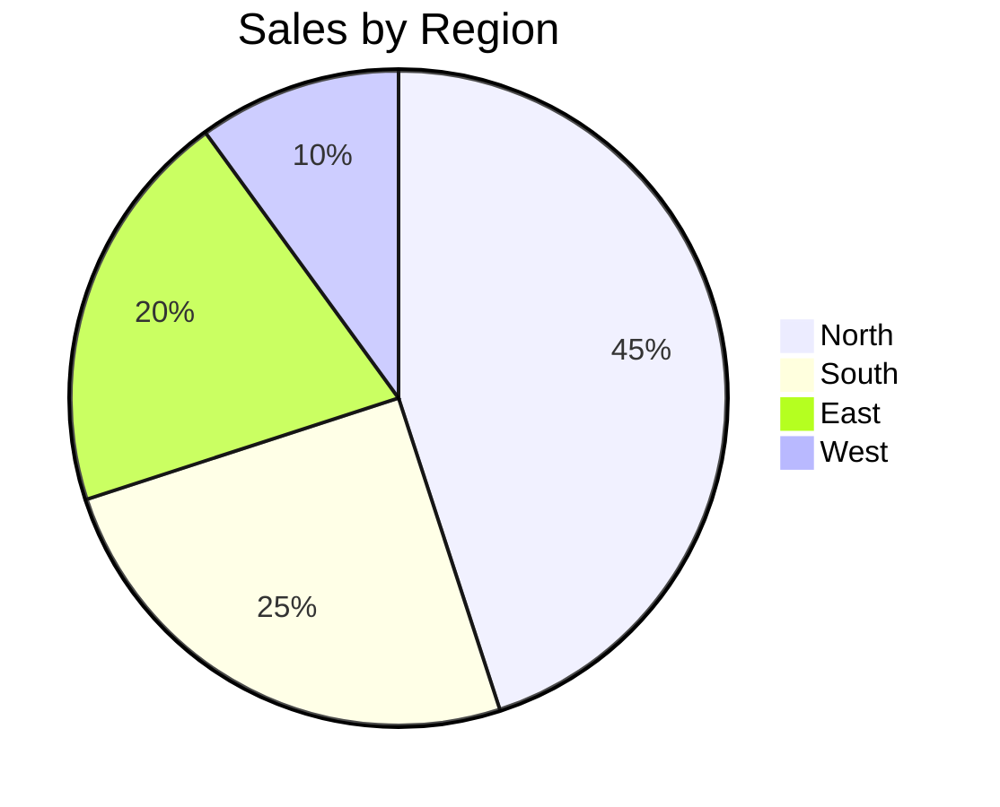
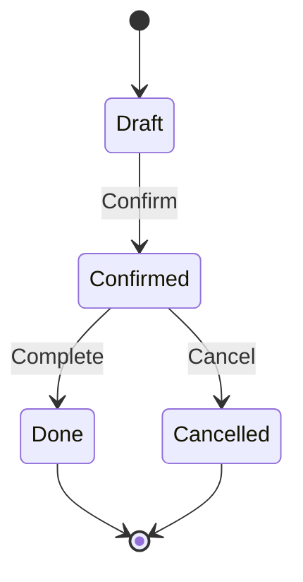
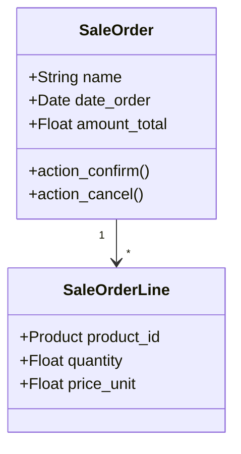

<p align="center">
  
</p>

<h1 align="center">Mermaid Diagrams for Odoo</h1>

<p align="center">
  <strong>Transform your Knowledge articles with beautiful, interactive diagrams</strong>
</p>

<p align="center">
  <a href="#features">Features</a> •
  <a href="#installation">Installation</a> •
  <a href="#usage">Usage</a> •
  <a href="#supported-diagrams">Diagram Types</a> •
  <a href="#technical-details">Technical</a> •
  <a href="#license">License</a>
</p>

<p align="center">
  
  
  
</p>

---

## ✨ What is This?

**Mermaid Diagrams** brings the power of [Mermaid.js](https://mermaid.js.org/) directly into Odoo's HTML editor. Create flowcharts, sequence diagrams, Gantt charts, and more—all rendered live inside your Knowledge articles, website pages, and any HTML field.

No external tools. No image exports. Just type your diagram code and watch it come to life.

---

## 🎬 See It In Action

<p align="center">
  
</p>

<p align="center">
  <em>A business process flowchart rendered directly in Odoo Knowledge — dark mode adaptive!</em>
</p>

---

## 🎯 Features

| Feature | Description |
|---------|-------------|
| 🎨 **Live Rendering** | Diagrams render instantly as you type |
| 🌓 **Theme Adaptive** | Automatically matches Odoo's light/dark mode |
| 📝 **Native Integration** | Works seamlessly in code blocks—no plugins needed |
| 🔒 **Secure** | Strict security mode prevents XSS attacks |
| 💾 **Persistent** | Diagrams save correctly with your content |
| ♿ **Accessible** | Full keyboard navigation and ARIA support |

---

## 📦 Installation

### Option 1: Git Clone

```bash
cd /path/to/odoo/addons
git clone https://github.com/K11E3R/mermaid_diagram.git
```

### Option 2: Download ZIP

1. Download from [GitHub Releases](https://github.com/K11E3R/mermaid_diagram/releases)
2. Extract to your Odoo addons directory

### Activate the Module

1. Restart Odoo server
2. Go to **Apps** → Update Apps List
3. Search for **"Mermaid Diagrams"**
4. Click **Install**

> **Dependencies:** This module requires the `html_editor` module (included in Odoo 19 core).

---

## 🚀 Usage

Creating diagrams is simple and intuitive. Follow these 3 easy steps:

### Step 1: Insert a Code Block

Type `/code` in any Knowledge article or HTML field to open the command menu, then select **Code**:

<p align="center">
  
</p>

---

### Step 2: Select Mermaid Language

Click the language dropdown (shows "Plain Text" by default) and select **Mermaid** from the list:

<p align="center">
  
</p>

---

### Step 3: Write Your Diagram

Enter your Mermaid syntax and watch it render automatically:



<p align="center">
  
</p>

<p align="center">
  <em>🎉 Your diagram is ready! Click on it anytime to edit.</em>
</p>

---

## 📊 Supported Diagrams

Mermaid supports a wide variety of diagram types:

### Flowchart



### Sequence Diagram



### Gantt Chart



### Entity Relationship Diagram



### Pie Chart



### State Diagram



### Class Diagram



> 📚 **Full documentation:** [Mermaid.js Docs](https://mermaid.js.org/intro/)

---

## 🔧 Technical Details

### Architecture

```
mermaid_diagram/
├── __manifest__.py          # Module metadata
├── __init__.py              # Python package init
├── static/
│   ├── description/
│   │   ├── icon.png         # Module icon
│   │   ├── banner.jpeg      # App store banner
│   │   └── index.html       # App store description
│   └── src/
│       ├── syntax_highlighting_patch.js   # Core rendering logic
│       └── mermaid_rendering/
│           └── mermaid_styles.scss        # Styling
```

### How It Works

1. **Patches Odoo's HTML Editor** - Extends `EmbeddedSyntaxHighlightingComponent` to recognize Mermaid as a language option
2. **Lazy Loads Mermaid.js** - Fetches Mermaid 11.x from CDN only when needed
3. **Theme Detection** - Reads Odoo's `data-color-scheme` attribute and adapts colors
4. **Source Preservation** - Stores original source as base64 in HTML comments for reliable persistence

### Browser Support

| Browser | Version |
|---------|---------|
| Chrome | 90+ |
| Firefox | 88+ |
| Safari | 14+ |
| Edge | 90+ |

### Performance

- **CDN-based loading**: Mermaid library loads only when first diagram is rendered
- **Render caching**: Diagrams only re-render when source changes
- **Lazy initialization**: Zero impact on pages without Mermaid blocks

---

## 🎨 Theming

The module automatically adapts to Odoo's theme:

| Element | Light Mode | Dark Mode |
|---------|------------|-----------|
| Primary Color | `#714B67` (Odoo Purple) | `#4a90a4` (Soft Blue) |
| Background | Transparent | Transparent |
| Text | `#374151` | `#e5e7eb` |
| Borders | `#e5e7eb` | `#4b5563` |

Custom CSS variables from your Odoo theme are respected:
- `--o-brand-primary`
- `--o-main-text-color`
- `--o-view-background-color`

---

## 🛠️ Troubleshooting

### Diagram not rendering?

1. **Check syntax** - Switch to "Plain Text" to edit raw code
2. **Verify Mermaid syntax** - Use [Mermaid Live Editor](https://mermaid.live/) to validate
3. **Check browser console** - Look for JavaScript errors

### Diagram disappears after save?

This is fixed in v19.0.1.0.0. The module now embeds source code as base64 comments for reliable persistence.

### Theme colors look wrong?

Clear browser cache and reload. The module reads CSS variables on initialization.

---

## 🤝 Contributing

Contributions are welcome! Here's how:

1. Fork the repository
2. Create a feature branch (`git checkout -b feature/amazing-feature`)
3. Commit changes (`git commit -m '[ADD] feature: description'`)
4. Push to branch (`git push origin feature/amazing-feature`)
5. Open a Pull Request

### Development Setup

```bash
# Clone repo
git clone https://github.com/K11E3R/mermaid_diagram.git

# Add to Odoo addons path
# Update your odoo.conf or use --addons-path

# Install in developer mode
./odoo-bin -d your_db -u mermaid_diagram --dev=all
```


---
<p align="center">
  <a href="https://github.com/K11E3R">
    <br />
    <sub><b>K11E3R</b></sub>
  </a>
  <br />
  <a href="https://github.com/K11E3R/mermaid_diagram" title="Code">💻</a>
  <a href="https://github.com/K11E3R/mermaid_diagram/issues" title="Bug Reports">🐛</a>
</p>

<p align="center">
  <sub>Built with ❤️ for the Odoo community</sub>
</p>

<p align="center">
  <a href="https://github.com/K11E3R/mermaid_diagram/stargazers">⭐ Star this repo</a> •
  <a href="https://github.com/K11E3R/mermaid_diagram/issues">🐛 Report Bug</a> •
  <a href="https://github.com/K11E3R/mermaid_diagram/issues">💡 Request Feature</a>
</p>
